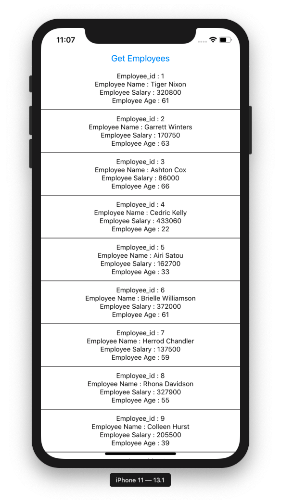

# typescript-redux-react-native-thunk

*Readme last updated March 31st, 2020*

This repo has proven to run on node v13.10.1 and Cocopods v1.9.1

After cloning this repo, do the following to see the app in action:

```
$ cd {clone-repo}/myTSReduxApp
$ yarn install
$ npx react-native run-ios

```

Then press the "Get Employees" button and you'll see this displayed:





## How this app was generated

(You don't need to execute these steps)

This React Native app is a Typescript version of [jkoutavas/redux-react-native-thunk](https://github.com/jkoutavas/redux-react-native-thunk). 
This "myTSReduxApp" React Native App was generated using:

```
$ react-native init myTSReduxApp --template react-native-template-typescript
$ cd myTSReduxApp
$ yarn add redux react-redux @types/react-redux redux-thunk typesafe-actions
```

TypeScript static typing is then applied based on the guidelines at [react-redux-typescript-guide](https://github.com/piotrwitek/react-redux-typescript-guide)

### Applied Joshua Avalon's type safety

On March 31st, the project was moved-over to using redux/typescript scheme as described in Joshua Avalon's [Create type-safe React Redux store with TypeScript](https://joshuaavalon.io/create-type-safe-react-redux-store-with-typescript) article. There was a tsc error that needs to be resolved after applying the article's implementation. With the help of @vhesener it was sorted-out and we seem to have a good solid basis for a Redux implementation, replacing the clunky [connect()-style Redux approach](https://react-redux.js.org/api/connect) with the [preferred hooks approach for dispatch, and selectors](https://react-redux.js.org/api/hooks).

[PR #5](https://github.com/jkoutavas/typescript-redux-react-native-thunk/pull/5) on this repository brought along this change, along with some comments I've made about the new approach.

Thank you @joshuaavalon for the inspiration of this more elegant approach to structuring TypeScript-based Redux.